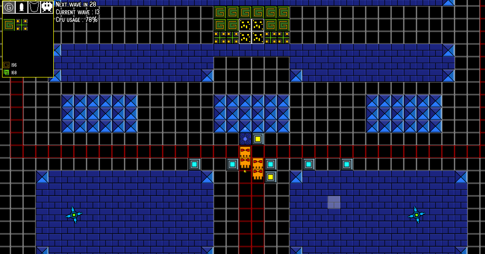
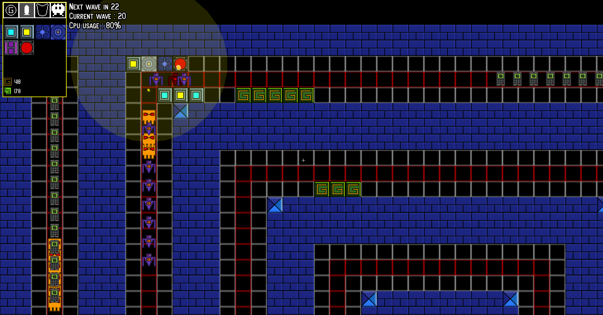
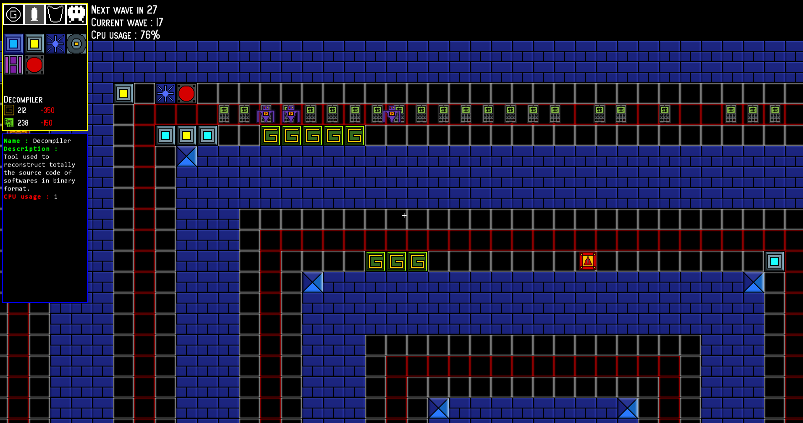

# Code Warfare

A retro Tower Defense game coded from scratch in C++ with SFML that I made when I was 15. The code is probably terrible.

---

## About the Game

**Code Warfare** is a tower defense game where you must protect your **computer system** from waves of **malware and viruses**.  
Defend your CPU, keep your temperature in check, mine crypto for upgrades, and deploy a range of security tools!

---

## Built With

- **C++**
- **SFML (Simple and Fast Multimedia Library)**
- Fully coded from scratch — no engines
- Hand-designed assets and game logic

## Screenshots

